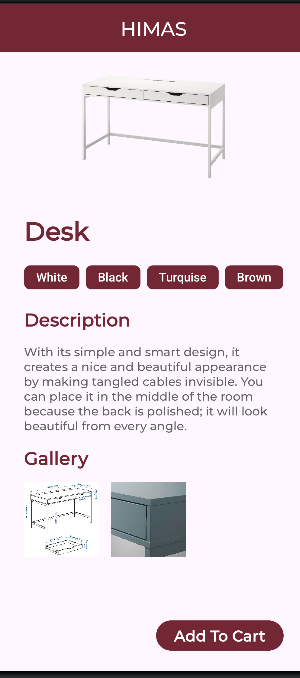
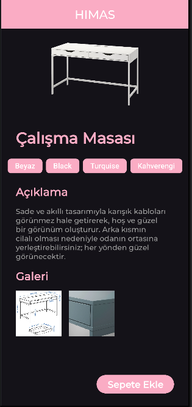
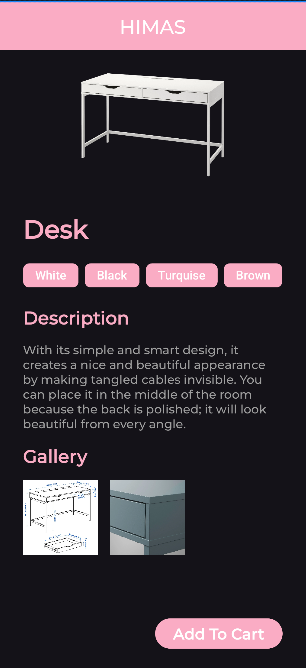
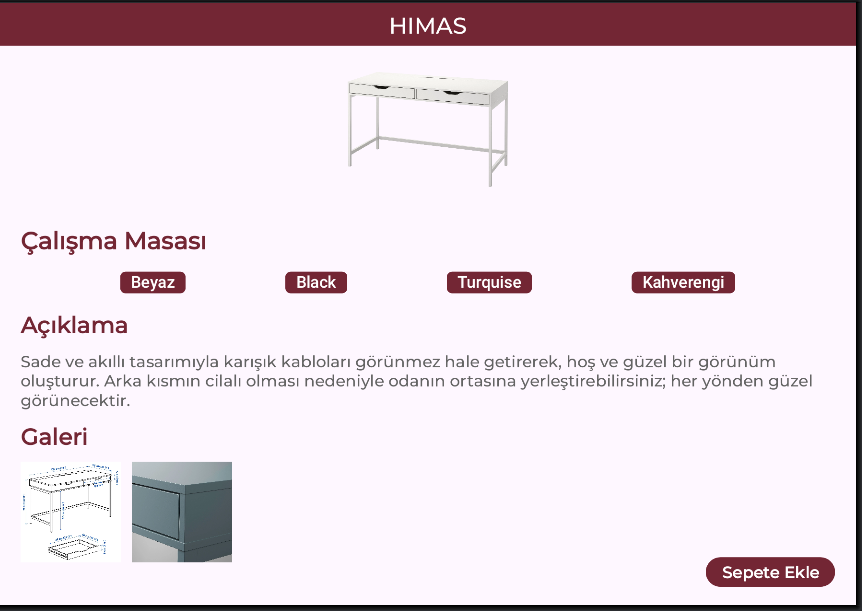
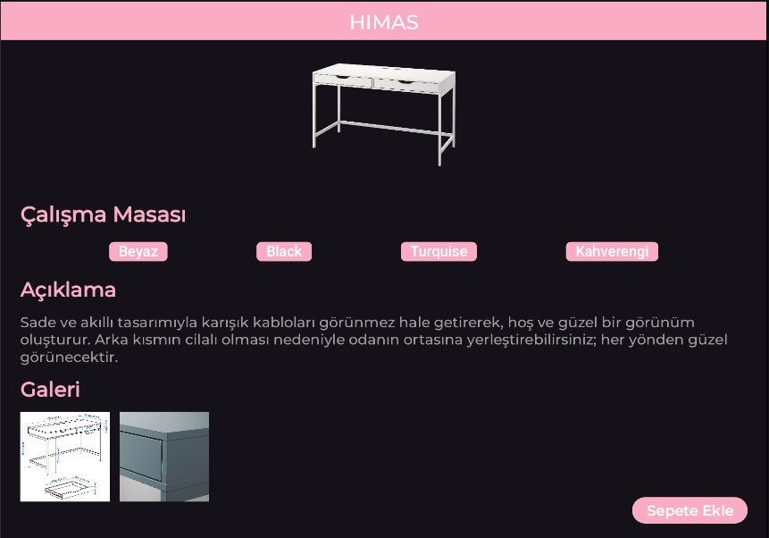

# Ödev 3

## 📚 Konu
Dersimizde işlenen aşağıdaki konuları kapsayan bir Android uygulaması tasarlandı:

- 🎨 Renk Tanımlama
- 🅰️ Özel Font Kullanımı
- 🌐 Çoklu Dil (İ18N) Desteği
- 📱 Çoklu Ekran (Responsive) Desteği
- 🌙 Dark Mode (Karanlık Tema) Desteği

## 🧠 Öğrenilenler
- `colors.xml` ve `themes.xml` dosyalarında özel tema oluşturma
- `res/font` klasörü altında özel yazı tipi kullanma
- `strings.xml` dosyalarını `values-tr`, `values-en` gibi klasörlerle çoğaltarak çoklu dil desteği sağlama
- `layout` yapısıyla farklı ekranlara uygun tasarım
- `night` klasörü kullanarak karanlık mod desteği oluşturma

## 📸 Ekran Görüntüleri

  
  
  
  
  
  

